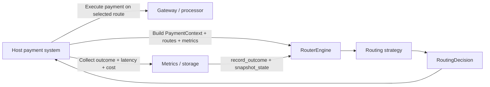

# smart-routing-algorithms

[](LICENSE)
[](sdk/python/smart_router/setup.py)
[](sdk/node/package.json)
[](sdk/go/go.mod)

`smart-routing-algorithms` is an in-process routing decision framework for payment orchestration systems. It focuses only on route selection logic and learning strategies.

It does not:

- run a server
- execute payments
- store data
- expose HTTP or RPC APIs

Your host system keeps ownership of payment execution, persistence, metrics collection, merchant rules, and operational controls. This library accepts routing inputs, selects a route, and learns from post-execution feedback.

## Why This Exists

Payment orchestration stacks typically need to optimize across competing route qualities:

- success rate
- latency
- cost
- reliability

The routing logic for those goals often gets mixed into application services, schedulers, or API layers. This project separates that concern into a reusable strategy framework with a stable integration surface.

## How It Fits Into an Existing System



Typical runtime flow:

1. The host builds a `PaymentContext` from the incoming payment request.
2. The host loads the currently available `RouteDefinition` objects.
3. The host loads a recent route metrics snapshot into `RouteMetrics`.
4. `RouterEngine` asks the active strategy to select the best route.
5. The host executes the payment using the chosen route.
6. The host feeds the actual result back through `record_outcome(...)`.
7. The host optionally persists `snapshot_state()` and restores it on restart.

## Core Concepts

### `PaymentContext`

Describes the payment being routed.

- `amount`
- `payment_method`
- `payer_bank`
- `region`
- `timestamp`

### `RouteDefinition`

Describes a route candidate available to the engine.

- `name`
- `cost`
- `capacity`

### `RouteMetrics`

Represents the host's current view of route performance.

- `success_rate`
- `error_rate`
- `avg_latency`
- `sample_size`

### `RoutingDecision`

Returned by every strategy.

- `selected_route`
- `score`
- `confidence`

## Built-In Strategies

The Python reference implementation currently includes these built-in strategies:

- `WeightedRouter`
- `EpsilonBanditRouter`
- `ThompsonSamplingRouter`
- `ContextualBanditRouter`
- `PredictiveFailureRouter`

Use them when:

- `WeightedRouter`: you want transparent deterministic scoring
- `EpsilonBanditRouter`: you want lightweight online learning with explicit exploration
- `ThompsonSamplingRouter`: you want probabilistic exploration driven by uncertainty
- `ContextualBanditRouter`: route quality changes by bank, payment method, amount, or time
- `PredictiveFailureRouter`: you want to avoid routes that are starting to degrade before they hard-fail

## Quick Start

### Python

```python
from core.router_engine import RouterEngine
from models.payment_context import PaymentContext
from models.route_definition import RouteDefinition
from models.route_metrics import RouteMetrics

context = PaymentContext(
    amount=149.99,
    payment_method="card",
    payer_bank="BankA",
    region="US",
    timestamp="2026-03-16T09:30:00Z",
)

routes = [
    RouteDefinition(name="route_a", cost=0.32, capacity=1000),
    RouteDefinition(name="route_b", cost=0.18, capacity=1000),
]

metrics = {
    "route_a": RouteMetrics(success_rate=0.97, error_rate=0.03, avg_latency=180, sample_size=2400),
    "route_b": RouteMetrics(success_rate=0.93, error_rate=0.07, avg_latency=95, sample_size=2500),
}

engine = RouterEngine(strategy="thompson")
decision = engine.route(context=context, routes=routes, metrics=metrics)

print(decision.selected_route, decision.score, decision.confidence)

# Host executes the payment, then feeds back the real outcome.
engine.record_outcome(
    route_name=decision.selected_route,
    success=True,
    latency_ms=112.0,
    cost=0.18,
)
```

### Load a Strategy by Instance

```python
from core.router_engine import RouterEngine
from strategies.contextual_bandit_router import ContextualBanditRouter

engine = RouterEngine(
    strategy=ContextualBanditRouter(
        route_preferences={
            "route_a": ["BankA"],
            "route_b": ["BankB"],
        }
    )
)
```

### Persist Strategy State

```python
snapshot = engine.snapshot_state()

# Save snapshot to your database, object store, or config service.

engine.restore_state(snapshot)
```

## Repository Layout

```text
smart-routing-algorithms/
  core/         # Engine, strategy base class, registry
  models/       # Typed contracts used by the engine
  strategies/   # Built-in strategy plugins
  benchmark/    # Traffic simulation and comparison tools
  sdk/          # Language-facing wrappers and scaffolding
  examples/     # Example integrations
  docs/         # Product documentation
  tests/        # Unit and parity tests
```

## Documentation Map

Start here depending on what you need:

- [docs/architecture.md](docs/architecture.md): product architecture, boundaries, and component model
- [docs/usage.md](docs/usage.md): how to use the library day to day
- [docs/integration.md](docs/integration.md): how to embed it into an existing orchestration system
- [docs/algorithms.md](docs/algorithms.md): algorithm intuition, formulas, tradeoffs, and strategy selection
- [docs/benchmarking.md](docs/benchmarking.md): simulation, comparison, and report interpretation

## Language Support

The Python code under `core/`, `models/`, `strategies/`, and `benchmark/` is the canonical implementation today.

The Node.js and Go SDK directories expose the same framework shape and baseline usage model, but the Python implementation is the most complete surface for advanced strategy work and benchmark tooling.

## Plugin Architecture

Strategies follow the `BaseRoutingStrategy` contract:

```python
class BaseRoutingStrategy:
    def choose_route(self, context, routes, metrics):
        ...

    def record_outcome(self, route_name, success, latency_ms, cost=None):
        ...

    def snapshot_state(self):
        ...

    def restore_state(self, state):
        ...
```

Strategies can be:

- instantiated directly
- loaded by name from `StrategyRegistry`
- registered dynamically by external plugins

Example:

```python
from core.strategy_registry import StrategyRegistry
from core.router_engine import RouterEngine
from strategies.weighted_router import WeightedRouter

StrategyRegistry.register("weighted_custom", WeightedRouter, overwrite=True)

engine = RouterEngine(strategy="weighted_custom")
```

## Benchmarking

The benchmark framework simulates transaction traffic and compares strategies on:

- success rate
- average latency
- average cost
- cost impact versus cheapest route

See [docs/benchmarking.md](docs/benchmarking.md) for full setup and analysis guidance.

## Testing

GitHub Actions runs the automated checks on every push and pull request through `.github/workflows/ci.yml`.

Local commands:

```bash
python -m unittest discover -s tests -p "test_*.py"
node tests/node_parity.test.js
cd sdk/go && go test -modfile=go.ci.mod ./...
```

The Go SDK uses `sdk/go/go.ci.mod` for tests because the checked-in `go.mod` still contains a publish-time placeholder module path.

## Contributing

See [CONTRIBUTING.md](CONTRIBUTING.md).

## License

MIT. See [LICENSE](LICENSE).
