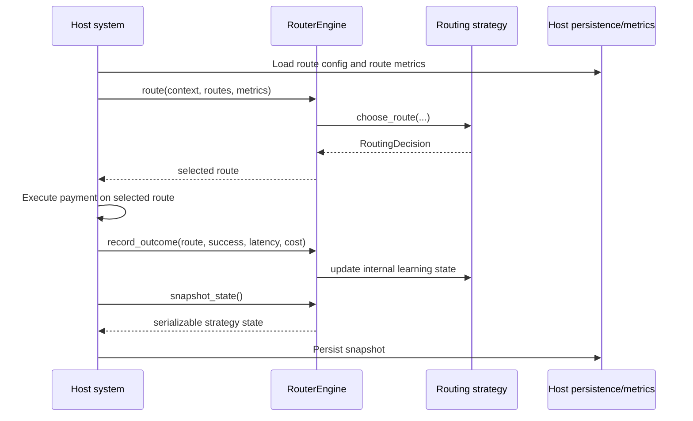

# Architecture

`smart-routing-algorithms` is a pure routing-decision framework. It is designed to live inside an existing payment orchestration platform and make route choices based on host-provided context, routes, and metrics.

## Product Boundary

This library owns:

- route scoring and selection
- strategy-specific learning state
- strategy registration and plugin loading
- simulation and strategy benchmarking

This library does not own:

- payment execution
- database storage
- stream processing
- APIs, servers, or dashboards
- merchant policy management
- route configuration distribution

That separation matters because it keeps the routing engine reusable across very different host platforms.

## High-Level Runtime Model



## Repository Component Model

### `models/`

Typed contracts shared across the framework:

- `PaymentContext`: describes the payment request
- `RouteDefinition`: describes each route candidate
- `RouteMetrics`: describes host-supplied route performance data
- `RoutingDecision`: describes the strategy output

These models are intentionally small so the host can map existing domain objects into them without introducing a new persistence model.

### `core/`

Framework control plane:

- `BaseRoutingStrategy`: contract every strategy must implement
- `RouterEngine`: stable execution surface used by the host
- `StrategyRegistry`: in-process plugin registry and factory loader

`RouterEngine` is intentionally thin. It validates inputs, resolves named strategies, delegates selection to the active strategy, and exposes feedback/state APIs back to the host.

### `strategies/`

Built-in routing strategies:

- `weighted`
- `epsilon_bandit`
- `thompson`
- `contextual_bandit`
- `predictive_failure`

Each strategy is a self-contained plugin. It owns its scoring logic, its learning state, and its serialization behavior.

### `benchmark/`

Offline evaluation tools:

- synthetic traffic generation
- repeated strategy comparison
- report generation

This layer lets you compare strategies before production rollout or after parameter changes.

### `sdk/`

Language-facing wrappers and scaffolding.

Today the Python implementation is the canonical engine. The Node.js and Go directories preserve the same framework shape and are intended to make cross-language integration easier.

## Core Execution Contract

Every strategy implements the same interface:

```python
class BaseRoutingStrategy:
    def choose_route(self, context, routes, metrics):
        ...

    def record_outcome(self, route_name, success, latency_ms, cost=None):
        ...

    def snapshot_state(self):
        ...

    def restore_state(self, state):
        ...
```

This gives the framework four stable phases:

1. Select a route using `choose_route(...)`.
2. Learn from actual execution using `record_outcome(...)`.
3. Export state with `snapshot_state()`.
4. Recover state with `restore_state(...)`.

## Data Flow Design

### Inputs

The host provides three input sets for every decision:

- `PaymentContext`: what kind of payment is being routed
- `list[RouteDefinition]`: which routes are currently eligible
- `dict[str, RouteMetrics]`: what current performance looks like

### Output

Every strategy returns:

- `selected_route`: route name
- `score`: strategy-specific numeric ranking value
- `confidence`: a normalized confidence estimate in `[0, 1]`

### Feedback Loop

The host sends actual execution outcomes back after the payment attempt:

- `success`
- `latency_ms`
- `cost`

This is what makes adaptive strategies possible without coupling the framework to your data stores.

## Strategy State Model

The framework treats strategy state as:

- local to the strategy
- serializable by the strategy
- persisted by the host

That means:

- the library never decides where state lives
- the host can persist state in SQL, Redis, S3, or config storage
- stateless and stateful strategies share the same runtime surface

Examples of strategy state:

- learned route rewards
- Beta posterior counts
- contextual reward observations
- route latency and error histories

## Plugin Architecture

### Manual Registration

```python
from core.strategy_registry import StrategyRegistry
from strategies.weighted_router import WeightedRouter

StrategyRegistry.register("weighted_custom", WeightedRouter, overwrite=True)
```

### Engine Resolution by Name

```python
from core.router_engine import RouterEngine

engine = RouterEngine(strategy="weighted_custom")
```

### Auto-Discovery

The Python registry supports loading plugins from:

- `importlib.metadata` entry points
- explicit module imports via `StrategyRegistry.autodiscover(...)`

This allows external packages to ship strategies without changing the core repository.

## Design Principles Behind the Architecture

### Small Surface Area

The host only needs to understand four models and one engine class. This keeps adoption low-risk.

### Strategy Isolation

Each strategy can evolve independently. Adding a new strategy does not require changing the host integration contract.

### Host Control

The host chooses:

- where metrics come from
- how often snapshots are taken
- which routes are eligible
- when a strategy is swapped or reconfigured

### Easy Benchmarking

Because the engine contract is small, the benchmark framework can reuse the same strategies and model objects as production integration code.

## Extending the System

To add a new strategy:

1. implement `BaseRoutingStrategy`
2. add deterministic route selection logic
3. add `record_outcome`, `snapshot_state`, and `restore_state`
4. register it with `StrategyRegistry`
5. add tests
6. include it in benchmarks if you want comparative analysis

For a practical extension walkthrough, see [usage.md](usage.md) and [integration.md](integration.md).
